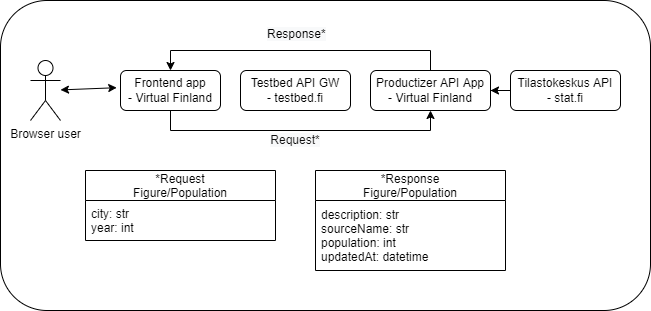

# testbed-test-productizer

A simple test testbed-productizer app


## Description

An example environment for setting up a data source for the use of the testbed dataspace.



_Figure: current state of the productizer data flow_

## Running the app

### Run locally with docker

#### docker compose

- `docker compose up`

#### docker run

- `docker build -t testbed-test-productizer .`
- `docker run --rm -it -p 8000:8000 testbed-test-productizer`

### Run locally with python

#### Requirements

- python >= 3.9
- python-pip
- make

#### Install

- `make install`

#### Usage

- `make run` # Run the app
- `make dev` # run with hot-reload

## Usage:

- After the app running..
- See endpoint documentation: http://localhost:8000/docs

## Developer notes:

When developmenting with a vscode editor, switch the python type-hinting to strictly enabled by a setting:

```
{
  "python.analysis.typeCheckingMode": "strict"
}
```

### References

- https://tilastokeskus.fi/ajk/verkkosivu-uudistus/uudistuksen-vaikutukset-statfin-tietokantaan.html
- Dokumentaatio: https://statfin.stat.fi/api1.html
- https://stat.fi/tup/alue/kuntienavainluvut.html#?year=2021&active1=SSS

Vanhat linkit:

- Tilastokeskuksen avoimet tietokanta-aineistot: https://www.stat.fi/org/avoindata/pxweb.html
- Dokumentaatio: http://pxnet2.stat.fi/api1.html
- API-linkki: https://pxnet2.stat.fi/PXWeb/api/v1/fi/Kuntien_avainluvut/
- Kannan rakenne: [https://pxnet2.stat.fi/PXWeb/api/v1/fi/Kuntien_avainluvut/?query=\*&filter=\*](https://pxnet2.stat.fi/PXWeb/api/v1/fi/Kuntien_avainluvut/?query=*&filter=*)
