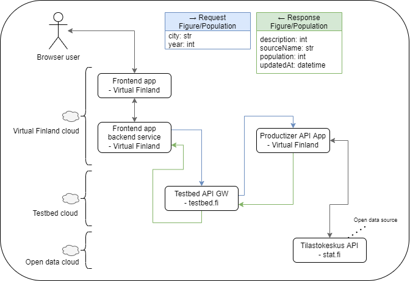

# testbed-test-productizer

An example data productizer app / API framework for python data producizers for the Virtual Finland Development use-cases.


[](https://vscode.dev/redirect?url=vscode://ms-vscode-remote.remote-containers/cloneInVolume?url=https://github.com/Virtual-Finland-Development/testbed-test-productizer)

## Description

An example environment for setting up a data source for the use of the testbed dataspace.

The current data flow between the front-end app, testbed and the produtizer API:



_Figure: current state of the productizer data flow_

Read more from the front app data requesting guidelines from ioxio.com/guides: [Requesting the data from a data source](https://ioxio.com/guides/how-to-build-an-application#requesting-the-data-from-a-data-source)

## Running the app

The development setup can be set up using docker, docker compose, vscode devcontainers or with local tools

### Run with vscode devcontainer

Read more of the vscode devcontainers here: https://code.visualstudio.com/docs/remote/containers

- Open the project folder as devcontainer
- Browse the API-docs at http://localhost:8000/
  - In the container, the default `postStartCommand` is set to `make dev` which should publish the endpoint

### Run locally with docker

#### docker compose

- `docker compose up`

#### docker run

- `docker build -t testbed-test-productizer .`
- `docker run --rm -it -p 8000:8000 testbed-test-productizer`

### Run locally with python

#### Requirements

- python >= 3.9
- python-pip
- make

#### Install

- `make install`

#### Usage

- `make run` # Run the app
- `make dev` # run with hot-reload

## Usage:

- After the app running..
- See endpoint documentation: http://localhost:8000/docs

## Developer notes:

When developmenting with a vscode editor, switch the python type-hinting to strictly enabled by a setting:

```
{
  "python.analysis.typeCheckingMode": "strict"
}
```

### References

- https://tilastokeskus.fi/ajk/verkkosivu-uudistus/uudistuksen-vaikutukset-statfin-tietokantaan.html
- Dokumentaatio: https://statfin.stat.fi/api1.html
- https://stat.fi/tup/alue/kuntienavainluvut.html#?year=2021&active1=SSS

Vanhat linkit:

- Tilastokeskuksen avoimet tietokanta-aineistot: https://www.stat.fi/org/avoindata/pxweb.html
- Dokumentaatio: http://pxnet2.stat.fi/api1.html
- API-linkki: https://pxnet2.stat.fi/PXWeb/api/v1/fi/Kuntien_avainluvut/
- Kannan rakenne: [https://pxnet2.stat.fi/PXWeb/api/v1/fi/Kuntien_avainluvut/?query=\*&filter=\*](https://pxnet2.stat.fi/PXWeb/api/v1/fi/Kuntien_avainluvut/?query=*&filter=*)
